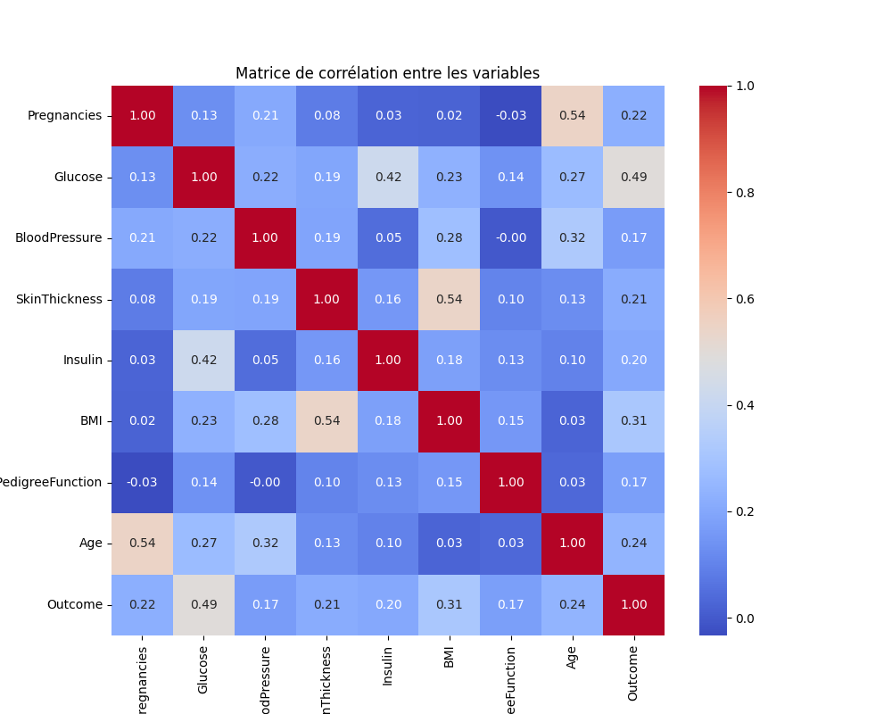

# 🧠 diabetes-prediction-ml  
**Mini-projet IA santé – Prédiction du diabète avec Machine Learning**

🎯 Objectif  
Utiliser un algorithme de machine learning pour prédire si une personne est susceptible de développer un diabète, à partir de **données médicales simples** :  
- Âge  
- IMC (Indice de Masse Corporelle)  
- Glycémie  
- Pression artérielle  
- Nombre de grossesses, etc.

Ce projet est conçu comme un **exercice pratique de machine learning appliqué à la santé**, avec une approche pédagogique.
🧪 Données utilisées
- 📊 **Dataset** : Pima Indians Diabetes Database  
- 📥 **Source** : [Kaggle - Pima Diabetes Dataset](https://www.kaggle.com/datasets/uciml/pima-indians-diabetes-database)  
- 📌 **Taille** : 768 observations × 9 variables (8 entrées + 1 sortie)

**Variables** :  
| Nom                      | Description                                 |
|--------------------------|---------------------------------------------|
| Pregnancies              | Nombre de grossesses                        |
| Glucose                  | Taux de glucose dans le sang                |
| BloodPressure            | Pression artérielle                         |
| SkinThickness            | Épaisseur du pli cutané triceps (mm)        |
| Insulin                  | Taux d'insuline                             |
| BMI                      | Indice de masse corporelle                  |
| DiabetesPedigreeFunction | Antécédents familiaux de diabète            |
| Age                      | Âge en années                               |
| Outcome                  | 1 = diabétique, 0 = non diabétique          |

🛠️ Outils et bibliothèques
- Python (Google Colab)
- pandas, numpy, matplotlib, seaborn
- scikit-learn (LogisticRegression, RandomForestClassifier)

🧠 Modèles entraînés
| Modèle               | Accuracy | Remarques                              |
|----------------------|----------|----------------------------------------|
| Régression Logistique| 70 %     | Simple, linéaire, facile à interpréter |
| Random Forest        | 78 %     | Plus performant, plus robuste          |

## 📊 Visualisation

### 🔥 Corrélation entre variables (heatmap)

🔥 Corrélation entre variables (heatmap)
[heatmap](heatmap.png)

🧬 Variables les plus importantes (selon Random Forest)
- Glucose
- BMI (IMC)
- Age

🧾 Résumé des étapes
1. Chargement et nettoyage du dataset
2. Analyse exploratoire des données (EDA)
3. Traitement des valeurs manquantes
4. Standardisation + Split train/test
5. Entraînement de deux modèles
6. Évaluation & Interprétation des résultats

🎥 Vidéo explicative (à venir)

💡 Limites & éthique
Ce modèle est **pédagogique**, basé sur un petit dataset, et **ne remplace pas un diagnostic médical**. Il illustre comment l'IA peut aider à **détecter des risques** et **assister le personnel médical**.

👨‍🔬 Projet réalisé par :
Franck – autodidacte en IA, fondateur de la chaîne [DIAP ∀](#)  

